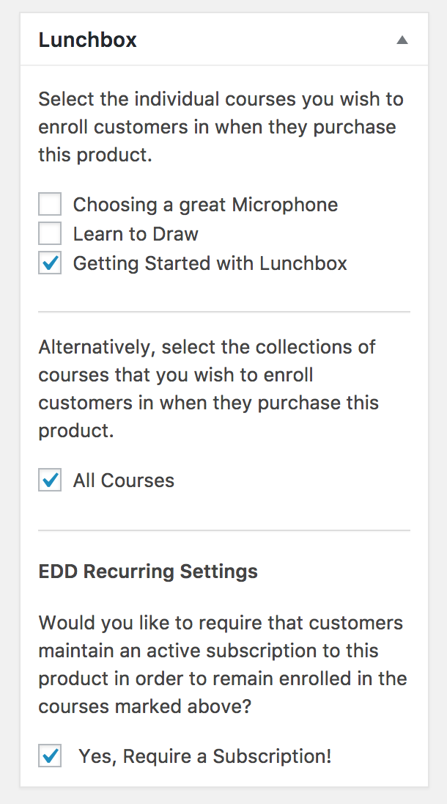

# Selling Courses with Easy Digital Downloads

It is possible to enroll a customer in a Lunchbox course once they successfully purchase an item through the Easy Digital Downloads WordPress plugin.

Once you have both the Easy Digital Downloads plugin and the Lunchbox plugin installed, you'll notice on your Download's page in the WordPress admin dashboard that there is a new metabox that allows you to choose the courses associated with that download.

Simply check the box next to each course that you would like to enroll your purchasers in. When a customer purchases that download, they will automatically be enrolled in the associated courses.
