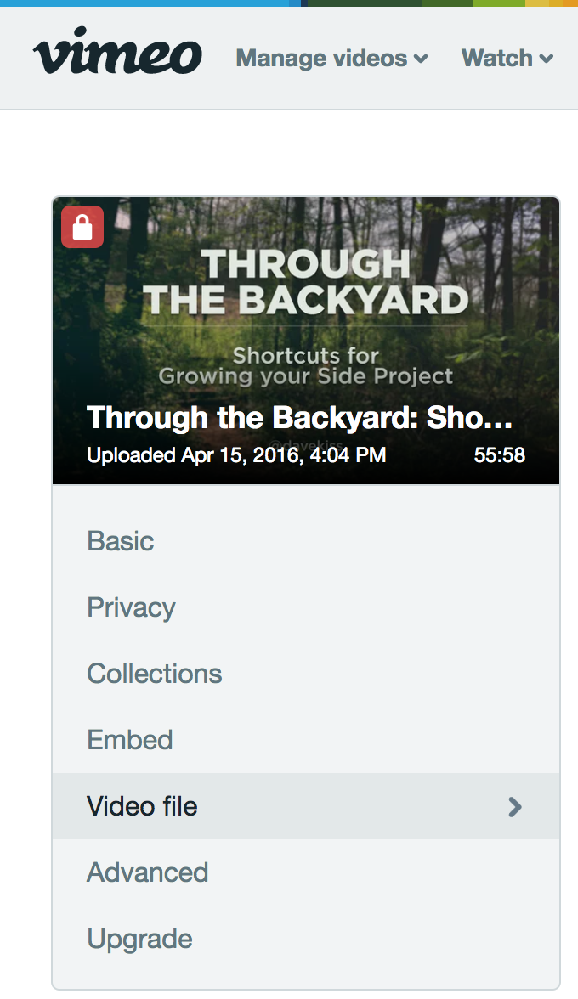
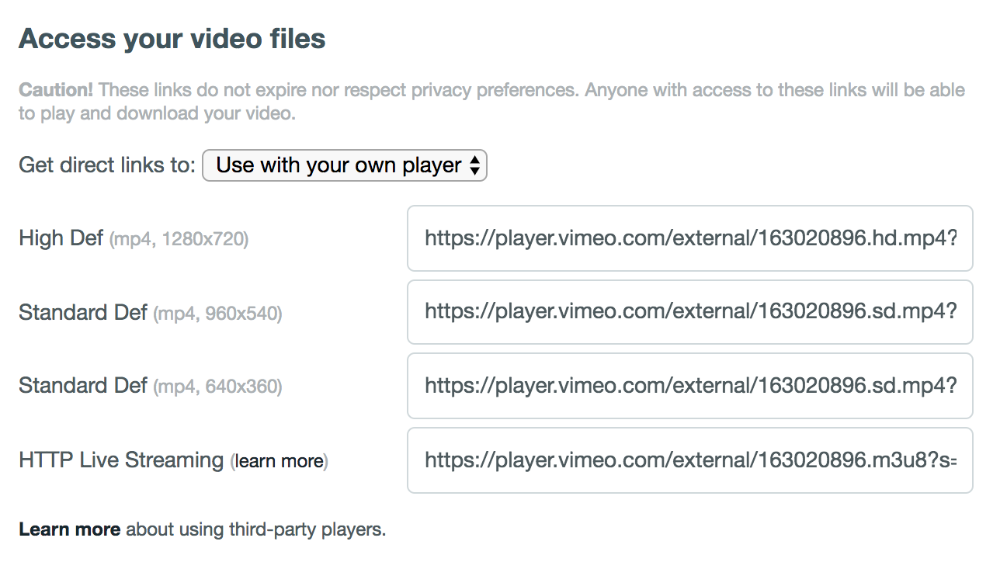

## Vimeo

If you'd like to show lessons that use Vimeo as the video hosting provider you'll need a Vimeo Pro account. This is a technical requirement, since Vimeo does not allow hiding the controls on their video player with a free account.

Once you've upgraded to Vimeo Pro, navigate to the Settings page of the video that you would like to use as your lesson.

In the sidebar on that page, choose the Video file tab.

Now, on the right side of the page, you'll see a section labeled Access your video files

Select the link located in the High Def text box and copy it. This is the link that you will paste into your Lunchbox lesson settings for the video url.

## YouTube

If you'd like to use YouTube as your video hosting platform, you can simply copy the YouTube link for the video that you'd like to use as your Lunchbox lesson and paste it into the Video URL input under that Lunchbox lesson's settings page.

## Amazon S3
