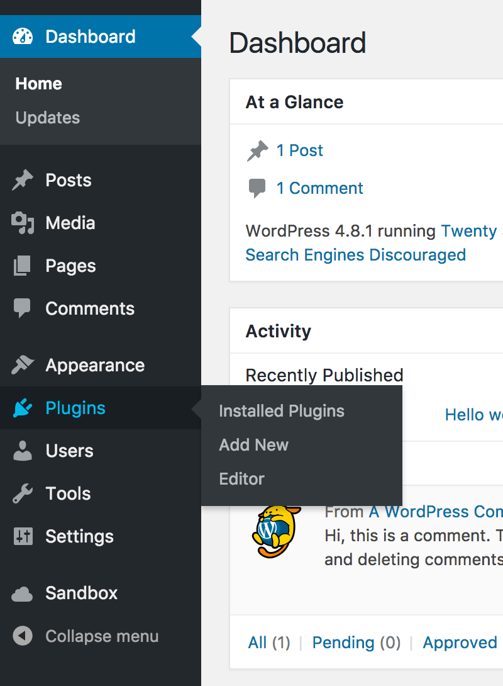
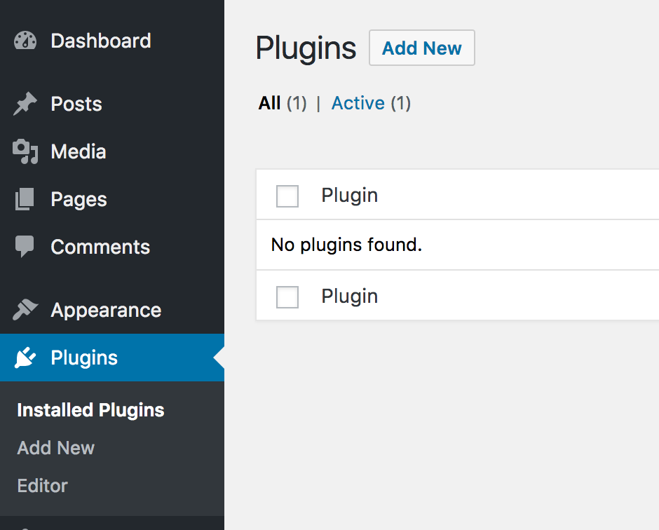
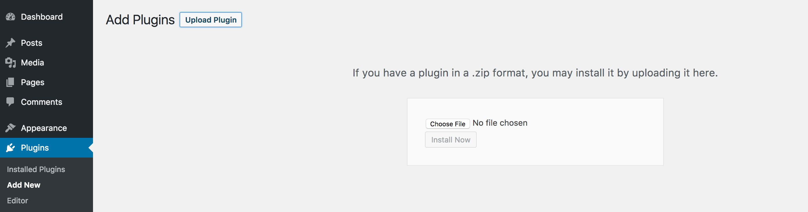

# Installation

Lunchbox is a WordPress plugin that can be installed on any self-hosted WordPress site or a WordPress.com site running on their Business tier.

## Plugin Requirements

- **A self-hosted WordPress site or WordPress.com site on the Business tier.**
- **Minimum WordPress version:** 4.7.2
- **Minimum PHP version:** 5.4

## Installation Steps

Sign in to your WordPress site and visit the **Admin Dashboard**. From the menu on the left side of the screen, click **Plugins** to visit the WordPress plugin manager.

In the top left corner of the screen, you'll see a button labeled **Add New** – click it, and you'll be taken to a new page where you can add your Lunchbox plugin.

You'll now see a button in the top left corner labeled **Upload Plugin** – click it, and you'll be presented with a screen which will allow you to select the Lunchbox plugin .zip file that you downloaded from your email receipt or Lunchbox account page.

Once you've selected your Lunchbox plugin, simply click **Install Now** to add Lunchbox to your site. Then, when prompted, make sure you click on **Activate Plugin** to be sure that the plugin setup process is completed. You're done!
