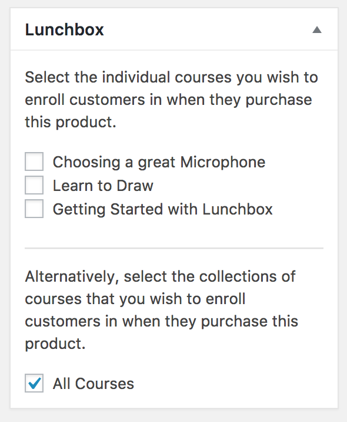

# Selling Courses with Woocommerce

It is possible to enroll a customer in a Lunchbox course once they successfully purchase an item through the WooCommerce WordPress plugin.

Once you have both the WooCommerce plugin and the Lunchbox plugin installed, you'll notice on your Product's page in the WordPress admin dashboard that there is a new  metabox  that allows you to choose the courses associated with that product.

Simply check the box next to each course that you would like to enroll your purchasers in. When a customer purchases that product, they will automatically be enrolled in the associated courses.
